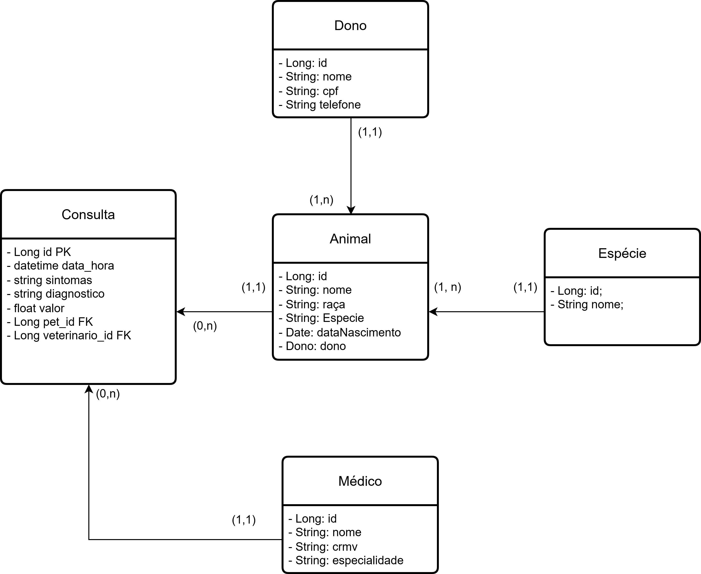

<h1 align="center">  🐇 Wapet API: Gestão de Clínica Veterinária </h1>
 Bem-vindo à VetCare API, uma solução robusta para o gerenciamento de atendimentos, pacientes (animais) e corpo clínico de uma clínica veterinária.

> :construction: Em construção :construction:

<h1 align="center"> Sobre o projeto </h1>
Esta API está sendo desenvolvida para centralizar o fluxo de uma clínica, desde o cadastro de tutores (Donos) até o registro detalhado de consultas e diagnósticos. A arquitetura foi pensada para garantir a integridade dos dados e a facilidade de manutenção.

<h1 align="center"> Modelagem dos dados </h1>
O coração da aplicação reside na relação entre os animais e seus históricos médicos. Abaixo, o diagrama que rege as regras de negócio:



> [!NOTE]
> A entidade Espécie é implementada via Enum para garantir a padronização dos dados no sistema (ex: CANINO, FELINO, REPTIL, AVE e ROEDOR).

<h1 align="center"> 🚀 Tecnologias utilizadas 🚀 </h1>

Java 17+

Spring Boot 3

Spring Data JPA (Persistência)

H2 Database (eventualmente PostgreSQL/MySQL)

Spring Doc / Swagger UI (Documentação Interativa)

Bean Validation (Garantia de dados íntegros)

<h1 align="center"> 🛠️ Funcionalidades (Endpoints) </h1>

A API oferece operações de CRUD completo para as seguintes entidades:

👤 Donos (Tutores): Cadastro e histórico de contato.

🐶 Animais: Gerenciamento dos pets vinculados a um dono.

🩺 Médicos (Veterinários): Registro de profissionais por CRMV e especialidade.

📝 Consultas: Onde a mágica acontece. Registro de sintomas, diagnóstico e valores.


<h1 align="center"> Como você pode executar ⚙️ </h1>

 Clone o repositório:

>> git clone https://github.com/KetlinOlliveira/clinica-vet-spring.git

Configure o banco de dados: Verifique o arquivo src/main/resources/application.properties para ajustar as credenciais.

```
Build e Run:

./mvnw spring-boot:run
```
<h1 align="center">Exemplos de Fluxo (Em desenvolvimento) </h1>

 Cadastrar um Dono: POST /donos

 Vincular um Animal: POST /animais (enviando o id_dono)

Registrar Consulta: POST /consultas (associando o animal_id e o medico_id)

<h3 align="center">Sendo desenvolvido com ❤️ por Ketlin</h3>

